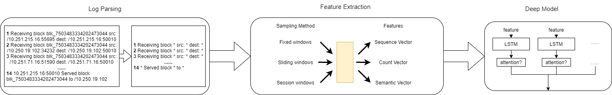

# logdeep

## Introduction

LogDeep is an open source deeplearning-based log analysis toolkit for automated anomaly detection.



*Note: This repo does not include log parsing，if you need to use it, please check [logparser](https://github.com/logpai/logparser)*

## Major features

- Modular Design

- Support multi log event features out of box

- State of the art(Including resluts from deeplog,loganomaly,robustlog...)

## Models

| Model | Paper reference |
| :--- | :--- |
|DeepLog| [**CCS'17**] [DeepLog: Anomaly Detection and Diagnosis from System Logs through Deep Learning](https://www.cs.utah.edu/~lifeifei/papers/deeplog.pdf)|
|LogAnomaly| [**IJCAI'19**] [LogAnomaly: UnsupervisedDetectionof SequentialandQuantitativeAnomaliesinUnstructuredLogs](https://www.ijcai.org/Proceedings/2019/658)|
|RobustLog| [**FSE'19**] [RobustLog-BasedAnomalyDetectiononUnstableLogData](https://dl.acm.org/doi/10.1145/3338906.3338931)

## Requirement

- python>=3.6
- pytorch >= 1.1.0
  
## Quick start

```
git clone https://github.com/donglee-afar/logdeep.git
cd logdeep
```

Example of building your own log dataset  
[SAMPLING_EXAMPLE.md](data/sampling_example/SAMPLING_EXAMPLE.md)

Train & Test DeepLog example

```
cd demo
# Train
python deeplog.py train
# Test
python deeplog.py test
```

The output results, key parameters and train logs will be saved under `result/` path

## DIY your own pipeline

Here is an example of the key parameters of the loganomaly model which in `demo/loganomaly.py`  
Try to modify these parameters to build a new model!

```
# Smaple
options['sample'] = "sliding_window"
options['window_size'] = 10

# Features
options['sequentials'] = True
options['quantitatives'] = True
options['semantics'] = False

Model = loganomaly(input_size=options['input_size'],
                    hidden_size=options['hidden_size'],
                    num_layers=options['num_layers'],
                    num_keys=options['num_classes'])
```

## Benchmark results

|       |            | HDFS |     | |
| :----:|:----:|:----:|:----:|:----:|
| **Model** | **feature** | **Precision** | **Recall** | **F1** |
| DeepLog(unsupervised)| seq |0.9583 | 0.9330 | 0.9454 |
| LogAnomaly(unsupervised) | seq+quan|0.9690 |0.9825 |0.9757 |
| RobustLog(supervised)| semantic |0.9216 |0.9586 |0.9397 |
